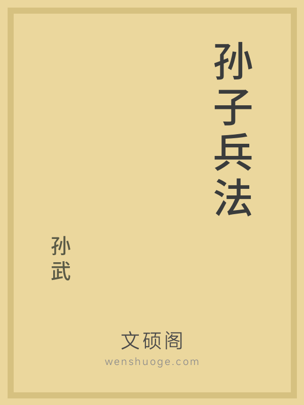

# Hi there 👋

欢迎访问我的github主页，需要公版书资源的朋友请访问：https://www.wenshuoge.com/

大家好，我是一个公版书爱好者。平时就喜欢收集整理那些进入公共版本范围的书籍，然后排版制作成电子版并免费分享出来。大家有没有和我一样想为中文公版书的传播、保存、保护等贡献自己一份力量的！

## 🍎你为什么要这么做？

文化是一个国家、一个民族的灵魂。文化兴国运兴，文化强民族强。

国外有很多公益组织在做公版版权书籍的免费发行，但是国内做的很少，即使有做的也是为了推广宣传他们的APP而已，强制你必须要登录，注册，安装app后才可以阅读，还不支持下载epub文件，并且禁止你进行二次分享。

我想这已经脱离了互联网分享精神的本质，应该像国外的《古腾堡计划》网站一样，由志愿者参与贡献，完全免费，无需登录注册，不需要下载任何app，仅通过浏览器就可以访问的分享平台。但是古腾堡计划中提供的中文书籍很少。

为了能让中文公版书的下载&阅读更简单，纯粹。我花两年多，每天抽出尽可能多的时间去整理和分享公版书，但是毕竟就我一个人，截止到目前为止才一共整理了一万多本公版书。所以我发起了《[传硕公版书保护计划](https://www.wenshuoge.com/)》简称“传硕计划”。来帮助把中国五千年的文明硕果进行电子化并服务于大众，此计划中收录的所有电子书都是免费、自由、无版权的。对所有的读者免费！

我希望有意愿的可以私信我，咱们已经一起共建 “传硕计划”！

## 🍎整理成果统计

- 共收集 13846 本公版书 
- 共整理 259450 个章节 
- 共整理 16.46 亿字

https://www.wenshuoge.com/ 正在缓慢整理中....

## 🍎什么是公版书？

根据我国现行「著作权法」第 20、21 条的规定，除署名权、修改权、保护作品完整权外，中国公民对其著作的法定权利均于作者死亡后第五十年的 12 月 31 日截止。超过著作权法保护日期后，其作品就进入了公有领域（公共版权）

这种因作者死亡超过 50 年而丧失发行权、改编权等著作权利的书籍，就称为“公共版权书籍”，简称“公版书”。

## 🍎传硕公版书保护计划

传硕公版书 网站提供了一个电子书编辑&分享平台，通过本网站提供的系统您可以将公版书的信息，章节等信息整理成一本完整的电子书并分享出来。简化了公共版权书籍到电子书的转换，并且允许多个志愿者参与编辑，校对，排版等！

中华文明5000多年绵延不断、经久不衰，在长期演进过程中，形成了中国人看待世界、看待社会、看待人生的独特价值体系、文化内涵和精神品质，这是我们区别于其他国家和民族的根本特征，也铸就了中华民族博采众长的文化自信。

使用 “传硕计划” 中的公版书 不需要获得许可（但是请注意要在 “合理使用” 范围内）。这适用于所有用途，包括商业用途。换句话说，即使是商业盈利用途，也无需支付版税。

源浚者流长，根深者叶茂。文化自信是一个国家、一个民族发展中最基本、最深沉、最持久的力量。

我们希望可以有更多的用户加入到 传硕计划 中来，让我们一起来保护传承文明的硕果。

https://www.wenshuoge.com/

