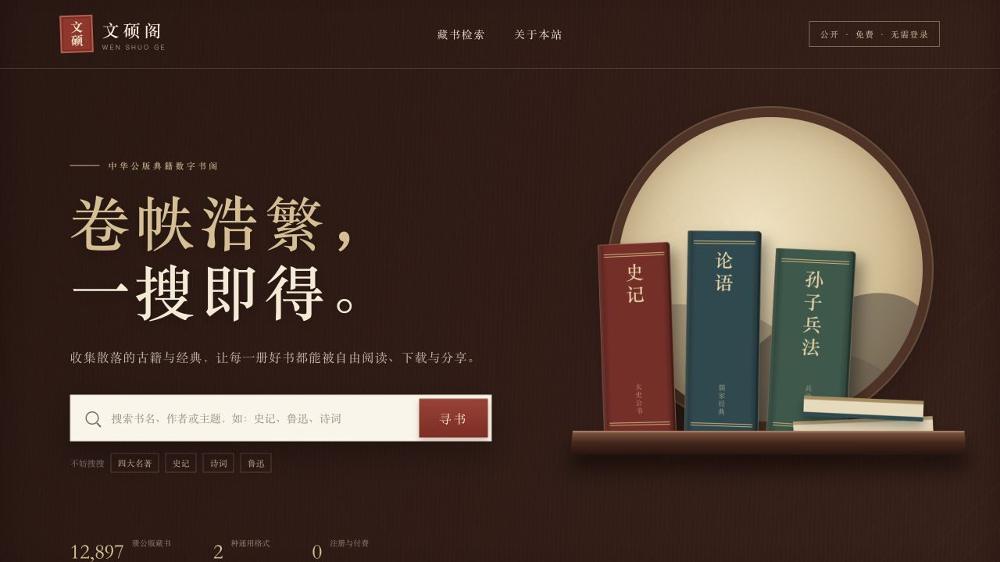

# 📚 文硕阁 · 中文公版书数字书阁

<div align="center">

**传承中华文化瑰宝 · 免费分享公版经典**

[🌐 在线访问](https://www.wenshuoge.com/) · [🔎 检索藏书](https://www.wenshuoge.com/#library) · [📖 电子书目录](#电子书列表)

</div>

---

## 🖼️ 网站预览

[](https://www.wenshuoge.com/)

> 正式站点已部署至 Cloudflare：**[www.wenshuoge.com](https://www.wenshuoge.com/)**

## 📖 关于文硕阁

大家好！我是文硕阁的创建者，一个热爱中华传统文化的公版书爱好者。

文硕阁致力于收集、整理和分享已经进入公共版权领域的中文经典著作，让这些文化瑰宝能够被更多人轻松检索、阅读和下载。网站完全公开免费，无需登录注册，不设会员，也没有广告。

## ✨ 网站能力

- 🔎 **即时检索**：支持按书名、作者和主题检索全部藏书
- 🗂️ **分类浏览**：自动归纳 15 个门类，可按类别直接浏览藏书
- 🧾 **增强书目**：分批核验简介、标签、作者小传、成书年代与资料来源
- 📚 **双格式取阅**：提供 EPUB、PDF 两种常用电子书格式
- 🪵 **拟物化设计**：木质书架、实体封面、宣纸与印章视觉效果
- 📱 **响应式布局**：适配桌面电脑、平板和手机
- 🌏 **全球边缘访问**：网站与电子书均由 Cloudflare 网络提供服务
- 🆓 **完全公开免费**：无需登录、无需注册、无会员、无广告

## 🧱 技术架构

网站前端、检索索引和电子书文件均可运行在 Cloudflare 服务中：

| 组件 | 用途 |
|:---|:---|
| **Cloudflare Workers** | 路由、电子书访问接口与安全响应头 |
| **Workers Static Assets** | 托管 HTML、CSS、JavaScript、封面和检索索引 |
| **Cloudflare R2** | 存放 `ebookfiles` 中的 EPUB、PDF 文件 |
| **Wrangler** | 本地开发、类型生成、R2 管理和生产部署 |
| **自动索引脚本** | 从 EPUB 提取元数据，生成分类、时代、标签、检索索引和详情分片 |

电子书通过 Worker 从 R2 流式返回，并支持 HTTP Range 分段读取，适合在线打开较大的 PDF 文件。公开检索索引经过紧凑化处理，当前约为 **1.67 MB**；书籍简介与来源按编号分片，只有打开详情时才按需加载。

### 项目目录

```text
├── ebookfiles/          # EPUB、PDF 原始电子书
├── metadata/batches/    # 分批核验的增强书目与互联网来源
├── public/              # 网站页面、样式、脚本和生成后的书目索引
├── scripts/             # 书目索引与 R2 上传脚本
├── src/                 # Cloudflare Worker 入口
├── docs/images/         # README 网站预览图
└── wrangler.jsonc       # Cloudflare 部署与绑定配置
```

## 🚀 开发与部署

### 本地运行

```bash
npm install
npm run dev
```

打开 `http://localhost:8787` 即可预览。书目检索可完整使用；本地 R2 未放入文件时，下载入口会提示文件尚未同步。

### 部署到 Cloudflare

首次部署前登录 Cloudflare，检查 R2 存储桶是否存在：

```bash
node node_modules/wrangler/bin/wrangler.js login
node node_modules/wrangler/bin/wrangler.js r2 bucket list
```

如果列表中没有 `wenshuoge`，再创建存储桶：

```bash
node node_modules/wrangler/bin/wrangler.js r2 bucket create wenshuoge
```

上传电子书并发布网站：

```bash
npm run upload:books
npm run deploy
```

`wrangler.jsonc` 已配置自定义域名 `www.wenshuoge.com`。域名需要位于同一个 Cloudflare 账户中；首次部署时 Cloudflare 会创建对应的 Worker 自定义域名记录。

R2 对象使用 `ebookfiles/<编号>/<文件名>` 作为存储键。每次新增电子书后，执行 `npm run index` 即可重建检索索引；`npm run check` 可在发布前完成类型检查与 Cloudflare 部署预检。

## 🧾 书目增强与分批整理

当前全部 **12,897** 册已根据书名、原始主题和简介自动划分统一分类与成书时代；缺少原始主题的书籍会自动补上分类和时代作为基础标签。

互联网核验采用可持续的分批机制：每一批在 [`metadata/batches`](metadata/batches/) 增加一个 JSON 文件，记录核验后的作者信息、成书年代、标签、简介和公开来源。运行 `npm run index` 后，新批次会自动合并到网站，而不会改写 EPUB 原文件。

目前已完成 **41 批、497 册**资料核验，其中 492 册为逐册增强，5 册为经书名与作品关系确认后的同作品版本继承。

前六批已经覆盖《洗冤集录》《傲慢与偏见》《孙子兵法》《论语》《史记》《周易》《黄帝内经》《红楼梦》《战国策》《三字经》《伤寒论》《尚书》《西游记》《心经》等经典，并对《罗织经》《小窗幽记》等作品的伪托或误署问题作出标注。第七批新增《围炉夜话》《弟子规》《三国演义》《冰鉴》《墨子》《百家姓》《聊斋志异》《搜神记》《传习录》《管子》《六祖坛经》和《淮南子》。第八批新增《了凡四训》《阴符经》《后汉书》《智囊（选录）》《神农本草经》《百战奇略》《幼学琼林》《笑林广记》《梦溪笔谈》《商君书》《孙膑兵法》和《列子》。第九批新增《水浒传》《明史》《格言联璧》《黄帝四经》《警世通言》《牡丹亭》《浮生六记》《三略》《抱朴子》《三命通会》《千金方》和《宋史》，重点补正章回版本、官修集体署名、出土帛书误署、残本伪续、传统托名及古代医术术数的阅读边界。第十批新增《难经》《周礼》《将苑》《尔雅》《曾国藩家书》《黄庭经》《子夏易传》《儒林外史》《晋书》《徐霞客游记》《朱子家训》和《贞观政要》，重点补正传统误署、伪托、集体纂修、现代选编及章回版本差异。第十一批新增《水经注》《幽梦影》《四十二章经》《孝经》《金匮要略》《旧唐书》《新唐书》《论衡》《地藏经》《随园诗话》《西厢记》和《醒世恒言》，重点补正传统译者或作者题署、官修史书集体署名、医籍今本形成和具体卷篇版本。第十二批新增《吴子》《茶经》《国语》《天工开物》《夜航船》《太平广记》《封神演义》《楞严经》《奇经八脉考》《神相全编》《濒湖脉学》和《阅微草堂笔记》，重点补正传统署名、集体编纂、真伪争议、节本与附录版本。第十三批新增《神仙传》《公羊传》《清史稿》《闲情偶寄》《棋经十三篇》《尉缭子》《云笈七签》《针灸大成》《东京梦华录》《孔子家语》《药性歌括四百味》和《太玄经》，重点补正作者题署、集体纂修、出土文献所见成书层次，以及电子目录与传统卷数的差异。第十四批新增《太平御览》《法华经》《隋书》《名贤集》《仪礼》《续资治通鉴》《四圣心源》《渊海子平》《镜花缘》《司马法》《随园食单》和《元史》，重点纠正现代整理者误作古籍作者、兵书误署、官修集体署名，并核清类书千卷、经史篇卷与现代电子目录的对应关系。第十五批新增《滴天髓阐微》《喻世明言》《博物志》《桃花扇》《悟真篇》《陶庵梦忆》《搜神后记》《剪灯新话》《魏书》《饮膳正要》《新五代史》和《东周列国志》，跳过已继承资料的重复《洗冤集录》，重点补正层累署名、伪托争议、后世补卷和电子本篇目取舍。第十六批新增《宋书》《容斋随笔》《太白阴经》《华严经》《食疗本草》《九章算术》《文始真经》《老子想尔注》《南史》《沧浪诗话》《大唐西域记》和《周书》，重点补正初编与全集、八十卷本与末附译品、残卷、辑佚本、传统托名和复合编纂关系。第十七批新增《通玄真经》《旧五代史》《人物志》《盐铁论》《齐民要术》《睡虎地秦墓竹简》《长生殿》《说苑》《北史》《绿野仙踪》《初刻拍案惊奇》和《日知录》，跳过已继承资料的重复《呻吟语》，重点补正残缺七卷本、辑复正史、出土简牍选编、百回与八十回小说版本及足本整理责任。第十八批新增《逸周书》《辽史》《北齐书》《梁书》《金史》《肘后备急方》《兵法二十四篇》《乾坤大略》《幽明录》《神峰通考》《老残游记》和《列女传》，重点辨明标准卷数与电子目录差异、原书与辑佚增补层次，并标注节编、残本、托名和传统医术术数的使用边界。第十九批新增《南齐书》《李卫公问对》《荣枯鉴》《扁鹊心书》《词源》《陈书》《武经总要》《生死场》《朝花夕拾》《故事新编》《伤逝》和《呼兰河传》，重点纠正后世编纂与现代托名，核清四十三卷兵书、医书附卷、现代文学初版与电子文件附加导读、序跋的差异。第二十批新增《萧红短篇小说集》《呐喊》《彷徨》《野草》《志摩的诗》《翡冷翠的一夜》《猛虎集》《赤都心史》《饿乡纪程》《涴漫的狱中日记》《迎头经》和《老张的哲学》，重点核清现代电子集本的缺篇、增篇与重篇，并标注两种现代瞿秋白精选本的选编责任和版权风险。第二十一批新增《猫城记》《赵子曰》《欧也妮·葛朗台》《高老头》《夏倍上校》《奥诺丽纳》《禁治产》《亚尔培·萨伐龙》《贝多芬传》《林徽因诗集》《唐诗杂论》和《林徽因散文集》，重点区分原著、译者与后世整理责任，并标注重复章、串书、缺篇和身后选编问题。

第二十二批新增《老舍散文集》《戴望舒诗集》《灾难的岁月》《南北极》《公墓》《爱眉小扎》《坟》《热风》《华盖集》《伪自由书》《云游》和《落叶》，重点辨认现代选编与历史初版，补正复合作者责任，并标注同题异篇、逐字重篇、按年份合页及跨体裁混编问题。

第二十三批新增《扬鞭集》《瓦釜集》《红烛》《死水》《沉沦》《迷羊》《小二黑结婚》《李有才板话》《三里湾》《李家庄的变迁》《福贵》和《登记》，重点纠正《福贵》的误题与《瓦釜集》的选编责任，核清现代诗集的缺篇、增篇、重篇和跨集混编，并逐一确认赵树理六部小说的章节与创作、初版时间。

第二十四批新增《孟祥英翻身》《“锻炼锻炼”》《实干家潘永福》《求雨》《邪不压正》《涛语》《日本人》《孙子浅说》《国防论》《欧洲文艺复兴史》《家庭的故事》和《取火者的逮捕》，重点补正原题、共同作者和误写篇名，辨明章节编号错误、历史集本缺篇、身后整理和电子本现代附加说明，并逐册确认正文结构与初版资料。

第二十五批新增《桂公塘》《飞鸟集》《新月集》《将军的故事》《第七连》《火灾》《茅山下》《迷宫》《日本国志》《人境庐诗草》《咆哮了的土地》和《短裤党》，重点补入泰戈尔两部诗集的郑振铎译者责任，区分历史初版本与现代选本，确认《茅山下》的未完遗稿性质，并标注缺篇、重篇、误记出版年和电子本附加说明。

第二十六批新增《异邦与故国》《冲出云围的月亮》《丽莎的哀怨》《少年漂泊者》《野祭》《最后的微笑》《菊芬》《中国史学通论》《李鸿章传》《现代中国文学史》《卡拉马佐夫兄弟》和《二马》，重点补正历史异题、日记篇名和耿济之译者责任，辨明现代增编与后加附录，并逐册核清初版年代、正文结构及版本层次。

第二十七批新增《十二金钱镖》《偷拳》《中书集》《文学闲谈》《海外寄霓君》《旧时代之死》《二月》《为奴隶的母亲》《柔石诗选》《黎·穆塔里甫诗选》《丰收》和《春风回梦记》，重点辨明续篇、书信集缺佚、单篇与同名集本、现代网络诗选和历史初版的边界，补入维吾尔族诗歌汉译责任，并校明目录异文与附加材料。

第二十八批新增《旧巷斜阳》《红杏出墙记》《春明外史》《金粉世家》《纸醉金迷》《八十一梦》《五子登科》《啼笑因缘》《丹凤街》《水浒新传》《牛马走》和《大江东去》，逐册核对长篇小说的书内目录与历史版本，标明《八十一梦》残缺五梦及尾声、《啼笑因缘》通行本删节、《牛马走》恢复全本，并补正《水浒新传》的全本出版年代和《大江东去》的目录讹字。

第二十九批新增《现代青年》《虎贲万岁》《傲霜花》《赵玉玲本纪》《风雪之夜》《北雁南飞》《欢喜冤家》《玉交枝》《蜀道难》《似水流年》《小西天》和《落霞孤鹜》，重点标明两部未完稿、《风雪之夜》的重复末章、《玉交枝》的整理收尾责任，并区分作品异名、现代导读、再版序跋和历史原目录。

第三十批新增《满城风雨》《魍魉世界》《开门雪尚飘》《梁山伯与祝英台》《偶像》《剑胆琴心》《孟姜女》《满江红》《如此江山》《燕归来》《秦淮世家》和《夜深沉》，重点区分《魍魉世界》与《牛马走》的删节关系，补入历史异名与连载资料，并标明重复章号、误写章题、问号章名和旧电子简介与正文相冲突之处。

第三十一批新增《山窗小品》《斯人记》《杨柳青青》《巷战之夜》《热血之花》《美人恩》《巴山夜雨》《啼笑因缘续集》《春明新史》《玉官》《道教史》和《春桃》，重点核清《山窗小品》的56篇构成、《巷战之夜》的三次题名、《道教史》未完成下编，并依据1935年生活书店扫描本确认当前《春桃》是许地山七篇后世选本，而非同名多人小说选集。

第三十二批新增《中国佛教史》《中国近代史》《人间词话》《中国画学全史》《鲁迅的青年时代》《大同书》《论中国学术思想变迁之大势》《白蛇全传》《三宝太监西洋记》《于絮尔·弥罗埃》《都尔的本堂神甫》和《比哀兰德》，重点订正初版年代、译者与异名，标明《中国画学全史》缺少原书四项附录、《三宝太监西洋记》第七十九回重复录入，并确认梁启超思想史著作的目录留阙属于原作未完。

第三十三批新增《搅水女人》《弥盖朗琪罗传》《托尔斯泰传》《老实人》《天真汉》《幻灭》三册、《恋爱与牺牲》《血纸人》《蓝色响尾蛇》和《三十三号魔屋》，重点补正法国原著与傅雷译本的出版层次，确认《弥盖朗琪罗传》未收法文版附录、《托尔斯泰传》采用1928年增订系统、三册《幻灭》合为同一长篇，并辨明莫罗阿合集的五篇构成及孙了红小说的历史异名、分章差异。

第三十四批新增《木偶的戏剧》《夜猎记》《赛金花的表》《鬼手》《计》《紫色游泳衣》《半个羽党》《囤鱼肝油者》《雀语》《一〇二》《民国演义》和《清史演义》，重点辨明孙了红小说的早期原作、1940年代改写、异题与初刊边界，补入《民国演义》续作者许廑父，并标明该书第四十回内容未缺却被错排到第一百六十回之后。

第三十五批新增《明史演义》《元史演义》《宋史演义》《五代史演义》《唐史演义》《南北史演义》《两晋演义》《后汉演义》《前汉演义》《恐怖而有兴味的一夜》《黑骑士》和《真假之间》，重点将九部蔡东藩演义从故事朝代纠正为民国成书年代，逐部核清六十回或一百回全本结构；同时确认《恐怖而有兴味的一夜》的1925年初刊、《黑骑士》的甲子年合作自序，并依据正文线索谨慎判定《真假之间》的战后年代。

第三十六批新增《燕尾须》《乌鸦之画》《窃齿记》《玫瑰之影》《白熊》《儿女英雄传》《隋唐演义》《三侠五义》《孽海花》《官场现形记》《二十年目睹之怪现状》和《西湖梦寻》，重点确认《燕尾须》与《囤鱼肝油者》的早期原作、后期扩写关系，保留尚无原刊证据作品的“初刊待考”边界；同时纠正《二十年目睹之怪现状》的作者错字与两部清代小说的时代误标，标明《三侠五义》第九十八回重复、《孽海花》的复合作者和未完性质，以及《西湖梦寻》的成书与初刻日期。

第三十七批新增《古文观止》《杨家将》《九尾狐》《飞花艳想》《九尾龟》《夜雨秋灯录》《国色天香》《艳异编》《郁离子》《隔帘花影》《东坡志林》和《何典》，重点补正共同编者、笔名、评点者和明人辑本责任，纠正《杨家将》的时代与体裁及《国色天香》的作者错字；同时确认《古文观止》电子本仅存前三卷四十三篇，《夜雨秋灯录》完整对应1877年初编，《九尾龟》为晚清十二集一百九十二回，《艳异编》是四十卷书坊删编系统，并区分《东坡志林》《何典》的写作、汇辑与初刊年代。

第三十八批新增《蜃楼志》《韩诗外传》《歧路灯》《八段锦》《折狱龟鉴》《嘉靖东南平倭通录》《风流悟》《江南燕》《青楼梦》《欢喜冤家》《近十年之怪现状》和《最近官场秘密史》，重点补正别号、编者、参订者与评校者责任，纠正《近十年之怪现状》的作者错字并区别许指严同名作品；同时标明《歧路灯》电子本缺最后八回且误标第二十二回、《折狱龟鉴》八卷来自四库重编、《嘉靖东南平倭通录》的四个“卷”只是电子分段，以及《八段锦》的卷首“序言”属于现代导读。

第三十九批新增《商界现形记》《七剑十三侠》《粉妆楼》《反唐演义传》《小五义》《续小五义》《英烈传》《续英烈传》《水浒后传》《说唐演义全传》《说唐演义后传》和《玉娇梨》，重点辨明晚清侠义小说、明代历史演义与清代说唐续书的原说、续编、校订及托名责任；同时确认《商界现形记》十六回虽全收却属未完稿，《续英烈传》第三十回误标为第二十回，并将当前六十六回《说唐演义全传》还原为陈汝衡据清代六十八回本修订的现代文本。

第四十批新增《好逑传》《混唐后传》《残唐五代史演义》《说岳全传》《乾隆游江南》《刘公案》《万花楼》《热血痕》《飞龙全传》《海公大红袍全传》《狄公案》和《包公案》，重点纠正钟惺、李贽、罗贯中、李春芳等书坊托名，以及施翠峰现代缩写者被误作古籍原作者的问题；同时将编号478的《包公案》辨明为明末无名氏《龙图公案》而非安遇时《百家公案》，并标明《残唐五代史演义》《狄公案》的逐字重回、《龙图公案》的缺则与重则，以及《刘公案》106回整理本和车王府107回说唱本的版本差异。

第四十一批新增《困学纪闻》《挥麈录》《鹤林玉露》《癸辛杂识》《绿牡丹》《杨家府演义》《二刻拍案惊奇》《三刻拍案惊奇》《咒枣记》《昭阳趣史》《玉闺红》和《闺门秘术》，重点纠正《绿牡丹》误署吴炳、《杨家府演义》把校阅者纪振伦当作原作者，以及《闺门秘术》把1907年误作最早刊年；同时辨明《二刻拍案惊奇》的两篇佚卷替补、《三刻拍案惊奇》与四十回《型世言》的改编关系，并标明《玉闺红》传本只存序和前十回。

网站详情页会区分“资料已核验”“同作品资料已核验”和自动整理状态，并显示来源链接。每一批的完整书目、说明和来源均保存在 [`metadata/batches`](metadata/batches/) 中。

## 🎯 我们的使命

文化是一个国家、一个民族的灵魂。我们相信：
- **文化兴国运兴** · 文化强民族强
- **源浚者流长** · 根深者叶茂
- **传承文明硕果** · 保护文化遗产

## 🌟 项目特色

- ✅ **完全免费** - 无需登录注册，无需下载APP
- ✅ **格式丰富** - 提供EPUB、PDF等多种电子书格式
- ✅ **纯净阅读** - 专注于内容，不含广告和商业推广
- ✅ **自由分享** - 支持下载和二次分享，传承互联网分享精神
- ✅ **持续更新** - 每天都在整理更多经典著作

---

## 📊 整理成果统计

| 📚 总藏书量 | 📖 整理章节 | 📝 总字数 | 🔄 更新状态 |
|:---:|:---:|:---:|:---:|
| **12,897本** | **259,450个** | **16.46亿字** | 持续整理中 |

**🕒 每日更新** · **📈 稳步增长** · **🌍 服务全球**

---

## 📚 电子书列表

本仓库包含当前整理的经典公版书籍，每个目录下均提供 **EPUB** 和 **PDF** 两种格式，方便不同设备阅读。

### 📖 国学经典

| 📚 书名 | 📂 目录 | 📄 格式 |
|:---|:---:|:---:|
| **孙子兵法** | [1](ebookfiles/1/) | EPUB · PDF |
| **论语** | [2](ebookfiles/2/) | EPUB · PDF |
| **菜根谭** | [3](ebookfiles/3/) | EPUB · PDF |
| **世说新语** | [4](ebookfiles/4/) | EPUB · PDF |
| **文心雕龙** | [5](ebookfiles/5/) | EPUB · PDF |
| **史记** | [6](ebookfiles/6/) | EPUB · PDF |
| **三十六计** | [7](ebookfiles/7/) | EPUB · PDF |
| **呻吟语** | [8](ebookfiles/8/) | EPUB · PDF |
| **颜氏家训** | [9](ebookfiles/9/) | EPUB · PDF |
| **韩非子** | [10](ebookfiles/10/) | EPUB · PDF |
| **庄子** | [11](ebookfiles/11/) | EPUB · PDF |
| **吕氏春秋** | [12](ebookfiles/12/) | EPUB · PDF |
| **荀子** | [13](ebookfiles/13/) | EPUB · PDF |
| **鬼谷子** | [33](ebookfiles/33/) | EPUB · PDF |
| **增广贤文** | [34](ebookfiles/34/) | EPUB · PDF |
| **三国志** | [35](ebookfiles/35/) | EPUB · PDF |
| **左传** | [36](ebookfiles/36/) | EPUB · PDF |
| **孟子** | [38](ebookfiles/38/) | EPUB · PDF |

### 📖 医学典籍

| 📚 书名 | 📂 目录 | 📄 格式 |
|:---|:---:|:---:|
| **洗冤集录** | [14](ebookfiles/14/) | EPUB · PDF |
| **黄帝内经** | [26](ebookfiles/26/) | EPUB · PDF |
| **本草纲目** | [37](ebookfiles/37/) | EPUB · PDF |

### 📖 文学作品

| 📚 书名 | 📂 目录 | 📄 格式 |
|:---|:---:|:---:|
| **茶馆** | [15](ebookfiles/15/) | EPUB · PDF |
| **我这一辈子** | [16](ebookfiles/16/) | EPUB · PDF |
| **月牙儿** | [17](ebookfiles/17/) | EPUB · PDF |
| **傲慢与偏见** | [18](ebookfiles/18/) | EPUB · PDF |

### 📖 经史子集

| 📚 书名 | 📂 目录 | 📄 格式 |
|:---|:---:|:---:|
| **山海经** | [22](ebookfiles/22/) | EPUB · PDF |
| **周易** | [23](ebookfiles/23/) | EPUB · PDF |
| **资治通鉴** | [25](ebookfiles/25/) | EPUB · PDF |
| **道德经** | [28](ebookfiles/28/) | EPUB · PDF |
| **大学章句集注** | [30](ebookfiles/30/) | EPUB · PDF |
| **中庸** | [31](ebookfiles/31/) | EPUB · PDF |
| **罗织经** | [39](ebookfiles/39/) | EPUB · PDF |
| **声律启蒙** | [40](ebookfiles/40/) | EPUB · PDF |

> 💡 **提示**: 点击目录链接可直接浏览对应电子书文件

---

## ❓ 什么是公版书？

根据我国现行《著作权法》第20、21条的规定，除署名权、修改权、保护作品完整权外，中国公民对其著作的法定权利均于作者死亡后第五十年的12月31日截止。超过著作权法保护日期后，其作品就进入了公有领域（公共版权）。

这种因作者死亡超过50年而丧失发行权、改编权等著作权利的书籍，就称为"公共版权书籍"，简称"公版书"。

## 📋 授权许可

本项目的电子书资源遵循 **合理使用** 原则：

- ✅ **无需获得许可** - 适用于所有用途，包括商业用途
- ✅ **无需支付版税** - 即使商业盈利用途也完全免费
- ✅ **支持自由分享** - 鼓励传播和二次创作

---

## 🤝 加入我们

文化自信是一个国家、一个民族发展中最基本、最深沉、最持久的力量。

我们诚挚邀请更多热爱中华文化的志愿者加入 **[传硕计划](https://www.wenshuoge.com/)**，让我们一起：

- 📚 收集整理更多公版经典
- 🎨 优化电子书排版质量
- 🌐 扩大传播范围和影响力
- 💡 开发更好的阅读体验

### 📮 联系方式

- 🌐 **官方网站**: https://www.wenshuoge.com/
- 📧 **邮箱**: [联系我们](mailto:contact@wenshuoge.com)
- 💬 **微信公众号**: 文硕阁

---

<div align="center">

**源浚者流长 · 根深者叶茂**

**让我们一起守护中华文化传承**

---

*Made with ❤️ for Chinese cultural heritage*

</div>
